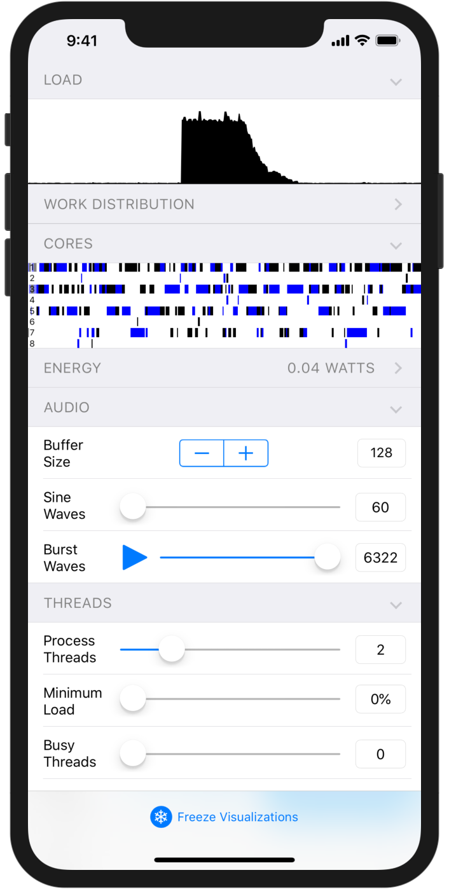

# 

An app for exploring real-time audio performance on iOS devices.

# Requirements

* Xcode 10 and above
* iOS 12 and above
* iPhone 5s and above

# License

This software is distributed under the [MIT License](./LICENSE).

# Visualizations and Controls

The ❄&#xFE0E; button in the toolbar freezes all visualization curves, which can be used to take a closer look at the data.

⚠️ Drawing visualizations is expensive and can impact the scheduling of audio threads in surprising ways. Measurements are collected even when frozen, so by briefly freezing, performing a test, and then unfreezing you can observe behavior without the confounding effect of drawing.

## Load

A graph of the amount of time taken to process each audio buffer as a percentage of the buffer duration. Drop-outs are drawn in red.

## Work Distribution

A stacked area graph showing the relative number of sine waves processed per thread. Colors represent threads and the CoreAudio I/O thread is drawn in black. A solid black graph, for example, indicates that the I/O thread has processed all sines. A half black/half blue graph indicates that two threads each processed an equal number of sines.

If work is not distrbuted evenly, then threads are likely being scheduled onto cores with different clock speeds. Note that the chunk size (`kNumPartialsPerProcessingChunk`) impacts the distribution when processing a small number of sines.

## Cores

A visualization of thread activity on each CPU core. Each row represents a core and each color represents an audio thread. On the iPhone 8, X, XS, and XR, the first four rows represent energy-efficient cores (Mistral/Tempest) and the last two rows represent high-performance cores (Monsoon/Vortex). The CoreAudio I/O thread is drawn in black.

## Energy

A graph of the estimated power consumption of the AudioPerLab process in watts. This can be used to compare the energy impact of different approaches for avoiding core switching and frequency scaling (see the Minimum Load and Busy Threads sliders).

## Audio

### Buffer Size

The preferred buffer size. The actual buffer size is logged and may differ from the displayed value.

### Sine Waves

The number of sine waves to be processed by the audio threads.

### Burst Waves

Pressing ▶ triggers a short burst of a configurable number of sine waves.

## Threads

### Process Threads

The total number of real-time threads that process sine waves.

### Minimum Load

The minimum amount of time to spend processing as a percentage of the buffer duration. If real audio processing finishes before this time, then artificial processing is added via a low-energy yield instruction. No artificial processing is added if real processing exceeds this time. Artificial processing is added to all audio threads and is not shown in the load graph.

When the real audio load is low, adding artificial load tricks the OS into scheduling audio threads onto high-performance cores and increasing the clock-rate of those cores. This allows sudden load increases (e.g. the burst button) without drop-outs.

### Busy Threads

The number of busy background threads to create. Busy threads are low-priority threads that constantly perform low-energy work.

For small buffer sizes (e.g. 128), adding a busy thread reduces the minimum load necessary in order for audio threads to be scheduled onto high-performance cores. Visualizations have the same effect as a busy thread, so they must be frozen to observe this behavior.

### Driver Thread

The driver thread's mode.

#### Waits for Workers

The driver thread wakes up and waits for processing threads, but does not process sines itself. Due to the non-processing driver thread, the total number of real-time threads (e.g., as shown in the Cores visualization) is one more than the "Process Threads" value.

The driver thread's automatically joined work interval is sometimes detrimental to performance. This mode can be used to avoid a work interval for all audio processing threads without calling a private API.

#### Processes Sines

The driver thread wakes up and waits for processing threads and processes sines as well. The total number of audio threads (e.g., as shown in the Cores visualization) is equal to the "Process Threads" value.

### Work Interval

When enabled, audio worker threads use a private API to join the [work interval](https://github.com/apple/darwin-xnu/blob/master/bsd/sys/work_interval.h) used by the CoreAudio I/O thread.

This appears to lower the amount of load necessary before the scheduler uses a high-performance core and reduces the amount of thread switching between cores.
