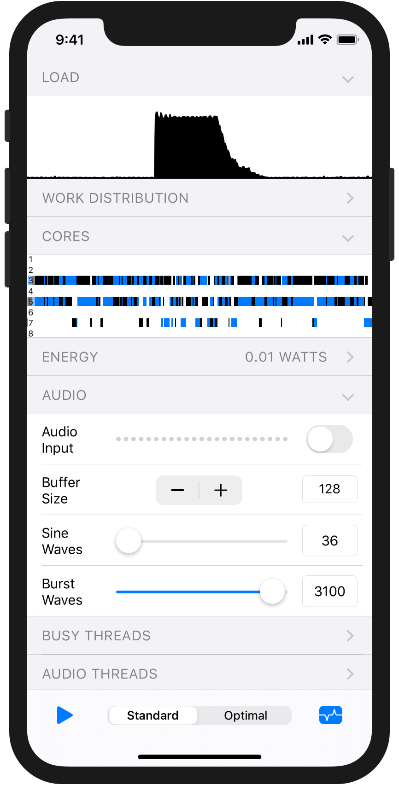

  

  <i>An app for exploring real-time audio performance on iPhone and iPad</i>

  

# Table of Contents

<!-- MarkdownTOC autolink="true" levels="1,2" -->

- [About](#about)
- [Recommendations](#recommendations)
- [Requirements](#requirements)
- [License](#license)
- [Visualizations and Controls](#visualizations-and-controls)
  - [Toolbar](#toolbar)
  - [Visualizations](#visualizations)
  - [Audio](#audio)
  - [Busy Threads](#busy-threads)
  - [Audio Threads](#audio-threads)

<!-- /MarkdownTOC -->

# About

The performance controller for [Apple Silicon](https://en.wikipedia.org/wiki/Apple-designed_processors) is tasked with balancing the competing interests of performance and energy efficiency. For light workloads, the performance controller saves energy by scheduling work onto efficiency cores and running them at low clock speeds. For heavier workloads, it moves the work to performance cores and ramps up their clock speeds.

For most apps, the performance controller strikes a good balance between these interests. Low-latency pro audio apps, however, are especially demanding, and performance isn't always optimal by default. AudioPerfLab provides an environment for testing workarounds to improve multi-threaded audio performance.

To simulate a demanding DSP workload, the app synthesizes a unison saw wave chord using additive synthesis. Sine wave partials are computed in parallel using a pool of real-time threads. Increasing the number of sine waves increases the DSP load. Pressing &nbsp;&nbsp; increases the number of waves all at once to test the system's response to a sudden load increase.

The [cores visualization](#cores) shows how audio threads are scheduled onto cores over time and the [energy visualization](#energy) shows power consumption. The main two workarounds to avoid CPU throttling are adding [artificial load to real-time threads](#minimum-load) and running [busy threads](#busy-threads) that perform low-energy work in the background. There are additional controls to tweak things like the [number of audio threads](#process-threads) and if those threads [join a workgroup](#work-interval).

See [High Performance Audio on iOS](https://youtu.be/ywrLAv5WNq4) from ADC '19 for more information.

# Recommendations

On iOS 13, real-time multi-threading doesn't work at low buffer sizes (< 512). For these buffer sizes, worker threads get scheduled onto efficiency cores with low clock speeds. These threads run so slow that a task that could be processed in 0.5ms on a fast core ends up taking more than 3ms, overshooting the 2.7ms deadline for a buffer size of 128.

If you need to support iOS 13, the [Busy Thread + Delegated DSP](https://www.youtube.com/watch?v=ywrLAv5WNq4&feature=youtu.be&t=1803) workaround described in the ADC talk (the "Optimal" preset) will make multi-threading perform well with small buffer sizes and increase burst processing power.

As of iOS 14, the [workgroup API](https://developer.apple.com/documentation/audiotoolbox/workgroup_management) should be used instead to inform the performance controller that worker threads contribute to meeting the audio device's deadline. With workgroups, multi-threaded audio works well for all buffer sizes. For most apps, no workaround is necessary. :partying_face:

However, if your app uses large buffer sizes (>= 512) and has a bursty DSP workload (i.e., CPU usage can jump to near the maximum at the touch of a button), using the [Busy Thread + Delegated DSP](https://www.youtube.com/watch?v=ywrLAv5WNq4&feature=youtu.be&t=1803) workaround instead of workgroups on iOS 14 will increase the processing power available for a burst. This workaround may stop working due to future changes in the performance controller, so it should not be dropped in as a preventative measure but rather be used to fix real-world performance problems.

# Requirements

* Xcode 12 and above
* iOS 13 and above
* iPhone 6s and above

# License

This software is distributed under the [MIT License](./LICENSE).

# Visualizations and Controls

## Toolbar

<table>
  <tr>
    <td width="70px">
         
        

    </td>
    <td>Trigger a burst of sine waves to test the system's response to a sudden load increase. The number of sines can be set with the Burst Waves slider.</td>
  </tr>
  <tr>
    <td>
       
      

    </td>
    <td>Switch between presets. The <b>Standard</b> preset uses CoreAudio as intended, with no workarounds. The <b>Optimal</b> preset uses the best known workaround to boost performance.</td>
  </tr>
  <tr>
    <td>
       
      

    </td>
    <td>Turn visualizations on and off. Pause visualizations to take a closer look at the data.</td>
  </tr>
</table>

⚠️ Drawing visualizations is expensive and can impact the scheduling of audio threads in surprising ways. You can observe behavior without the confounding effect of drawing by briefly turning visualizations off, performing a test, and then turning them back on.

## Visualizations

### Load

A graph of the amount of time taken to process each audio buffer as a percentage of the buffer duration. Drop-outs are drawn in red.

### Work Distribution

A stacked area graph showing the relative number of sine waves processed per thread. Colors represent threads and the CoreAudio I/O thread is drawn in black. A solid black graph, for example, indicates that the I/O thread has processed all sines. A half black/half blue graph indicates that two threads each processed an equal number of sines.

If work is not distributed evenly, threads are likely being scheduled onto cores with different clock speeds. Note that the chunk size (`kNumPartialsPerProcessingChunk`) impacts the distribution when processing a small number of sines.

### Cores

A visualization of thread activity on each CPU core. Each row represents a core and each color represents an audio thread. On iPhone 8 and up, the first four rows represent energy-efficient cores and the last two rows represent high-performance cores. The CoreAudio I/O thread is drawn in black.

### Energy

A graph of the estimated power consumption of the AudioPerfLab process in watts. This can be used to compare the energy impact of different approaches for avoiding core switching and frequency scaling (see the Minimum Load and Busy Threads sliders).

## Audio

### Audio Input

Toggle if audio input is enabled. A meter is shown to check that input is working.

This can be used to check for performance differences due to the audio configuration. One known difference is the background CPU usage allowance on iOS 13:

* Only output: 48s over 60s (80% average)
* Input and output: 9s over 15s (60% average)

Note that the CPU usage is tracked per-thread and not per-process.

### Buffer Size

The preferred buffer size. The actual buffer size is logged and may differ from the displayed value.

### Sine Waves

The number of sine waves to be processed by the audio threads.

### Burst Waves

Pressing &nbsp;&nbsp; in the toolbar triggers a short burst of a configurable number of sine waves.

## Busy Threads

Busy threads are low-priority threads that perform low-energy work to prevent CPU throttling. Each thread alternates between blocking on a condition variable and working. Blocking for some of the time avoids termination due to excessive CPU usage when the app is running in the background.

Note that visualizations can have the same effect as a busy thread, so they should be frozen to observe the effect of busy threads alone.

### Threads

The number of threads to create. On iOS 12 and 13, there is no benefit to using more than one.

### Period

The duration of one busy thread loop iteration. Higher values may reduce energy usage by reducing overhead.

### CPU Usage

The percentage of the period spent performing low-energy work. This value needs to be set high enough to prevent CPU throttling and low enough to avoid termination when the app is running in the background.

## Audio Threads

### Process Threads

The total number of real-time threads that process sine waves.

### Minimum Load

The minimum amount of time to spend processing as a percentage of the buffer duration. If real audio processing finishes before this time, artificial processing is added via a low-energy wait instruction. No artificial processing is added if real processing exceeds this time. Artificial processing is added to all audio threads and is not shown in the load graph.

When the real audio load is low, adding artificial load tricks the OS into scheduling audio threads onto high-performance cores and increasing the clock-rate of those cores. This allows sudden load increases (e.g. the burst button) without drop-outs.

### Driver Thread

The driver thread's mode.

#### Waits for Workers

The driver thread wakes up and waits for processing threads, but does not process sines itself. Due to the non-processing driver thread, the total number of real-time threads (e.g., as shown in the Cores visualization) is one more than the "Process Threads" value.

The driver thread's automatically joined work interval is sometimes detrimental to performance. This mode can be used to avoid a work interval for all audio processing threads without calling a private API.

#### Processes Sines

The driver thread wakes up and waits for processing threads and processes sines as well. The total number of audio threads (e.g., as shown in the Cores visualization) is equal to the "Process Threads" value.

### Work Interval

When enabled on iOS 14, audio worker threads join the audio device's [workgroup interval](https://developer.apple.com/documentation/audiotoolbox/workgroup_management). The workgroup API is not available prior to iOS 14, so on older systems workers instead use a [private API](https://github.com/apple/darwin-xnu/blob/master/bsd/sys/work_interval.h).

Joining the work interval informs the performance controller that worker threads contribute to meeting the audio device's deadline, giving them a performance boost.

At low buffer sizes (<= 256), this boost is necessary to perform even small amounts of DSP. This can be observed by turning off visualizations, disabling busy threads, and dialing in a small number of sustained sine waves (e.g., 500). Audio will constantly drop out unless the work interval is enabled.
